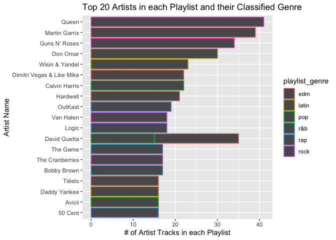
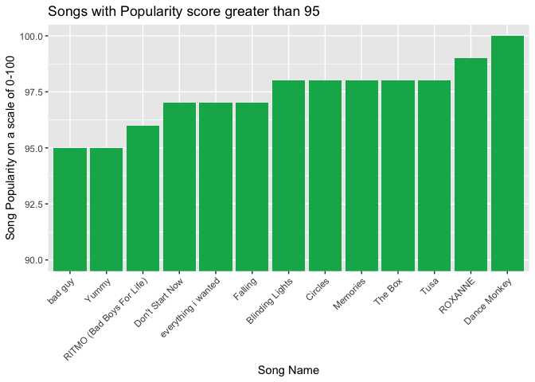
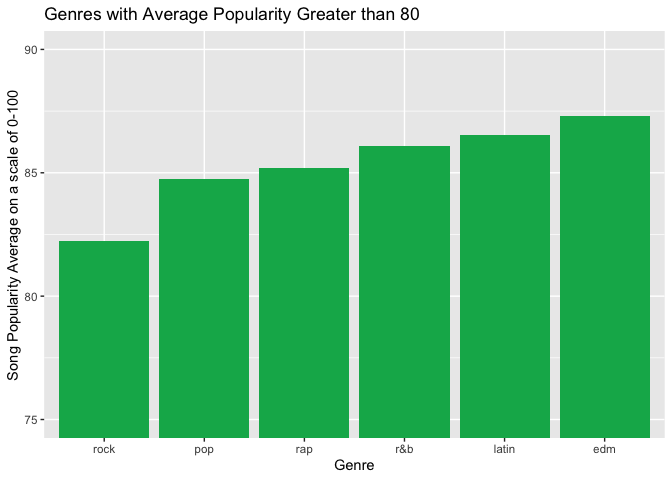
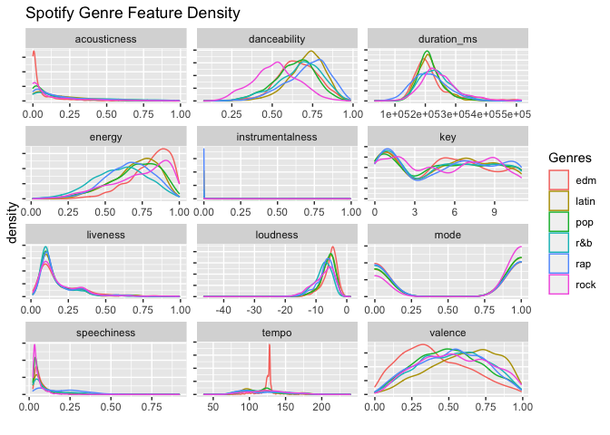
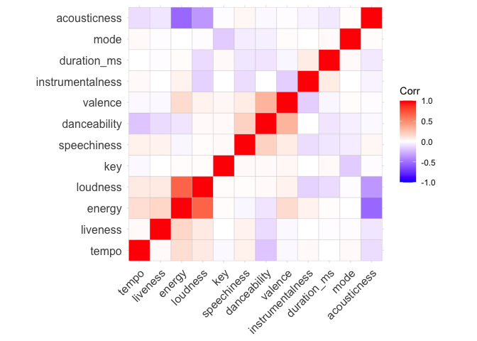
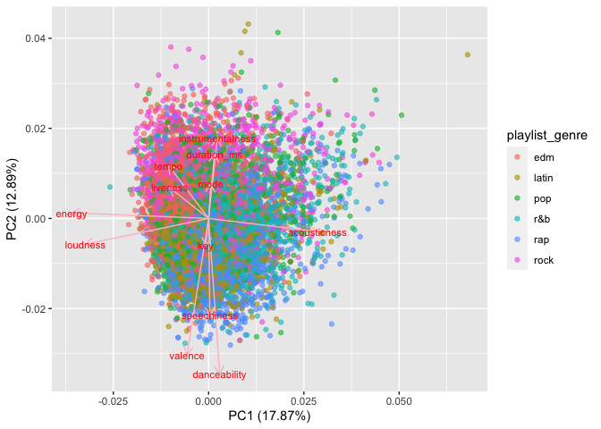
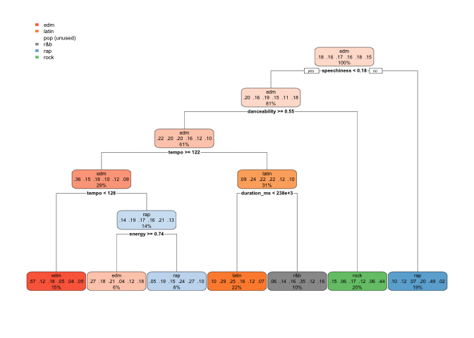
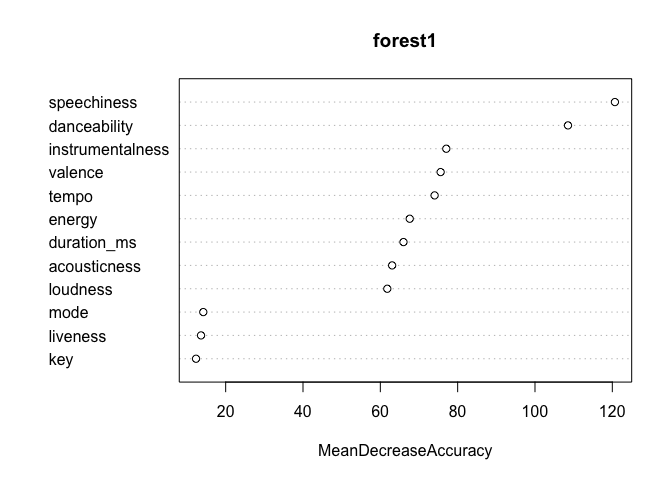
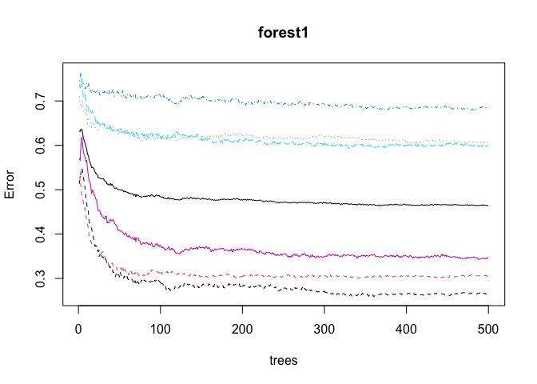
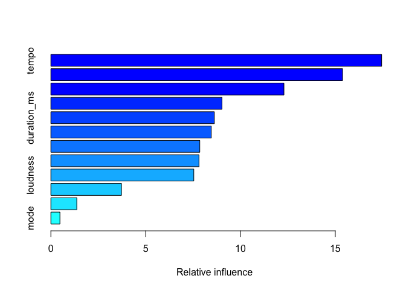

# Spotify: Telling Stories of Music Genre Through Data

## Abstract

This study attempts to understand classification of genres using
Spotify’s engineered audio features. Using songs in Spotify playlists,
we attempt to answer what makes each genre unique, if anything. However,
some of Spotify’s features seem repetitive. We suggest models that
attempt to reduce dimensions of audio features for this reason. We
prioritize interpretability and ‘bake-off’ supervised learning methods
that involve tree decisions, random forests, and gradient boosted
methods. The random forest method prevails among the rest. The
supervised and unsupervised methods provide information for each genre
except R&B You can’t dance to Rock, but you can to Latin. EDM is popular
with high tempo, and a close second to Latin for danceability. Pop does
not represent any unique features and proves difficult to classify based
on this data set.

## Introduction

Spotify is one of the largest audio and media streaming service
providers. This is in part due to their recommendation system, a feature
of the platform that consumers return regularly for. Their data
collection is a crucial component in their business model that allows
for this well-implemented feature. Spotify allows their listeners to put
together their own playlists while stamping each song with a genre
classification. Do the audio features that Spotify engineers on their
own help describe a genre? This project takes Spotify data sets from the
SpotifyR package in an attempt to understand how songs are given a genre
classification. SpotifyR is an R wrapper which pulls track audio
features and other information from Spotify’s Web API. We attempt to
tell a story through various methodologies. Random forests prevail in
telling our story of genre classification.

## Methods 1.1

The data features are plentiful but ambiguous at first glance. Let’s go
through each feature and describe what’s happening under the hood.
Spotify has curated these unique features to help them assess
information about the songs they recommend to listeners.

### Audio features of the Data set

**Track\_Popularity** is a track’s popularity ranging from 0 to 100. The
higher the score, the higher the track’s popularity. According to
Spotify, popularity is calculated by an algorithm and is based, in the
most part, on the total number of plays the track has had and how recent
those plays are. Generally speaking, songs that are being played a lot
now will have a higher popularity than songs that were played a lot in
the past.

**Danceability** describes how suitable a track is for dancing based on
a combination of musical elements including tempo, rhythm stability,
beat strength, and overall regularity. A value of 0.0 is least
‘danceable’ and 1.0 is most danceable.

**Energy** represents a perceptual measure of intensity and activity.
Typically, energetic tracks feel fast, loud, and noisy. For example,
Slayer, a death metal band, surely has high energy. Meanwhile a track
composed by Mozart may score low on the scale. Features contributing to
this attribute include general entropy, perceived loudness, dynamic
range, timbre, and onset rate.

**Key** ranges from integers 0 to 11 and map to pitches that represent
the key a track is in. This is because when analyzing post-tonal music,
and assuming octave and enharmonic equivalence is appropriate (this is a
fancy way of saying we classify what sounds sound the same), integers
can represent pitch class. For example, all C’s and any notes that are
enharmonically-equivalent to C (like B-Sharp) are pitch class 0. All
C-sharps’s and any notes that are enharmonically-equivalent to C-sharp
(like D-flat) are pitch class 1.

**Loudness** is the quality of a sound. It is the analog of a physical
stength or amplitude of a track. It is measured in decibels (dB) and
averaged across the entire track. Loudness is useful for comparing
relative loudness among songs in the data set. It ranges roughly from
-60 to 0.5 dB.

**Mode** indicates the modality of a track and thus the type of scale
from which the tracks melodic content is derived from. It is a binary
variable that assigns a 0 to tracks that have a minor scale and a 1 to
tracks that have a major scale.

**Speechiness** detects the presence of spoken words in a track. If a
track appears more speech-like in its recording (like a podcast might),
then the speechiness score will be greater. This is a proportion, and
thus the features values range from 0 to 1. For this feature, values
that are less than 0.33 are considered music and perhaps even
instrumental music. Values between 0.33 and 0.66 are generally
considered music tracks that include both music and speech. Podcast such
as tracks have a proportion of 0.66 or greater. Since this data set only
has music, we will see the former range throughout the data set.
Furthermore, features such as speechiness are exactly why scaling the
data is necessary. Allowing for raw ranges of values would create a bias
in the data results.

**Acousticness** represents a confidence measure from 0 to 1 on whether
the track is acoustic. 1.0 represents a high confidence and 0 represents
a low confidence.

**Instrumentalness** represents a prediction of whether the track
contains vocals and the scale is from 0 to 1. The greater the score, the
greater the likelihood the track is to instrumental. Tracks that have
more vocals (such as rap) score lower on this scale. Tracks that score
0.5 or higher are *intended* to represent instrumental tracks. Thus,
scaling the data provides useful for how tracks compare in this data
set.

**Liveness** detects the presence of an audience in the recorded track.
This could be, for example, Pink Floyd’s live performance of their Dark
Side of the Moon album. There is clearly a difference between this
recording and the album when it was recorded in a studio setting.
Typically, if a track scored higher than 0.8 it is likely it was
recorded with an audience. Again, scaling will provide useful for this
feature.

**Valence** measures the musical *positiveness* of a track and is scored
from 0 to 1. Tracks with valence closer to 1 sound more positive (i.e. -
cheerful, euphoric) and tracks with low valence appear more negative
(i.e. - sad, angry).

**Tempo** is an overall estimate of a track’s beats per minute (BPM).
This is the speed of a track that is calculated by taking the average
beat duration.

**Duration\_ms** is simply the duration of the track in milliseconds.

## Methods 1.2

The following section allows for exploration of the data to provide some
information about relationships among features in the data set. Before
diving into methodologies, visualizing relationships provides general
but important information to further develop the Spotify genre story
while partially motivating what methodologies to choose from.

<table class="table" style="width: auto !important; margin-left: auto; margin-right: auto;">
<thead>
<tr>
<th style="text-align:left;">
Genre
</th>
<th style="text-align:right;">
Count
</th>
</tr>
</thead>
<tbody>
<tr>
<td style="text-align:left;">
edm
</td>
<td style="text-align:right;">
1861
</td>
</tr>
<tr>
<td style="text-align:left;">
latin
</td>
<td style="text-align:right;">
1560
</td>
</tr>
<tr>
<td style="text-align:left;">
pop
</td>
<td style="text-align:right;">
1679
</td>
</tr>
<tr>
<td style="text-align:left;">
r&b
</td>
<td style="text-align:right;">
1627
</td>
</tr>
<tr>
<td style="text-align:left;">
rap
</td>
<td style="text-align:right;">
1763
</td>
</tr>
<tr>
<td style="text-align:left;">
rock
</td>
<td style="text-align:right;">
1509
</td>
</tr>
</tbody>
</table>

### Figure 1: Popular Artists

Above we observe the top artists that appear across all playlists
regardless of genre. We see that all artists are classified in one type
of genre except for David Guetta who appears 35 times in both pop and
EDM playlists. This technically puts David Guetta in third place for
this data set. Rock is the most popular genre thanks to Queen and Guns
N’ Roses.

### Figure 2: Song Popularity

When filtering for most popular songs in the data set, we observe
Roxanne (Arizona Zerva) rated second highest following Dance Monkey
(Tones and I), and a 5-way tie with Blinding Lights (The Weekend),
Cirlces (Post Malone), Memories (Maroon 5), The Box (Roddy Rich), and
Tusa (Carol G).

### Figure 3: Genre Popularity

Taking the average of song popularity in each playlist genre, we see
that EDM has the highest average. With David Guetta and Martin Garrix
being two of the artists that appear in the most amount of playlists,
this makes sense. It is worth recalling that popularity is partially
dictated both by how recent and how many times songs have been played.

### Figure 4: Kernel Densities of Audio Features

Creating kernel density estimates show the probability distribution
functions of each feature, and is essentially a smoothed over histogram.
For each genre, there represents a distribution faceted by audio
feature. At the aggregate level, songs from the data set seem to have
low confidence in acousticness, low probability they are instrumental,
not likely to have been recorded with a live audience, and low
speechiness. However, danceability, valence, loudness, and energy have
higher levels of probability associated with them.

One issue, however, is that features measure over all the tracks that
Spotify offers to listeners. To remedy this, data is sampled and scaled
before performing any statistical modeling. The second issue is that
many of these features seem a bit repetitive in measuring similar
attributes of tracks. For example, what is the difference between
**Acousticness**, **Speechiness**, and **Instrumentalness**? The answer
is that the latter two features represent a prediction and probability
*score* while the former feature actually *detects* what is within a
track. This will serve as reason to perform a PCA analysis to understand
groups of data. Performing decision trees, random forests, gradient
boosted rees and will provide meaningful, interpretable information for
such a problem. This is discussed in the modeling section.

## Results

This section incorporates methodologies to attempt to classify the songs
based on their features into genres and we discuss results. We utilize
PCA analysis to help explain the relative distances/groupings of songs
and their genre classifications. Then, we turn to decision trees that
ultimately help us understand genres more than the former method does.

### PCA Analysis

We look at a principle component analysis for dimension reduction
techniques.

#### Figure 5: Audio Features Correlation Plot

When observing correlations of features, we re-order the features
according to hierarchical clustering. We can observe that acousticness
has a strong, negative correlation with energy and loudness. Perhaps
acoustic songs make listeners generally feel less energy, and they are
also not associated with tracks that have higher dB (i.e. - loudness).
Danceability and valence have a strong, positive correlation. Perhaps
this correlation can be attributed to the idea that if songs make
listeners feel happier, then they will want to dance more. Some
relationships that do not seem intuitive is the negative correlation
between danceability and tempo, where higher tempo may induce listeners
to dance more. Either way, certain audio features normally exist with
others while some generally do not appear together in great magnitude at
all. Is it worth using this analysis component to tell stories of
genres? This is answered below.

    ## Importance of first k=3 (out of 12) components:
    ##                           PC1    PC2     PC3
    ## Standard deviation     1.4644 1.2439 1.08600
    ## Proportion of Variance 0.1787 0.1289 0.09828
    ## Cumulative Proportion  0.1787 0.3076 0.40592

There are several takeaways from observing the summary of the analysis.
We see the standard deviation of the PCs is highest in PC1. The
proportion of variance each PC accounts for from the original data is
low and hovers between .09 and .1787, but this proportion is highest in
PC1. Cumulatively, all three principle components account for a little
more than two-thirds of the variation from the original data. The
variation is not well preserved in the the three principle components.
However, the dimension reduction helps tell a story of what audio
features generally move together as discussed below.

<table>
<caption>
Principle Components
</caption>
<thead>
<tr>
<th style="text-align:left;">
</th>
<th style="text-align:right;">
PC1
</th>
<th style="text-align:right;">
PC2
</th>
<th style="text-align:right;">
PC3
</th>
</tr>
</thead>
<tbody>
<tr>
<td style="text-align:left;">
danceability
</td>
<td style="text-align:right;">
0.05
</td>
<td style="text-align:right;">
-0.59
</td>
<td style="text-align:right;">
0.07
</td>
</tr>
<tr>
<td style="text-align:left;">
energy
</td>
<td style="text-align:right;">
-0.61
</td>
<td style="text-align:right;">
0.02
</td>
<td style="text-align:right;">
0.03
</td>
</tr>
<tr>
<td style="text-align:left;">
key
</td>
<td style="text-align:right;">
-0.01
</td>
<td style="text-align:right;">
-0.10
</td>
<td style="text-align:right;">
0.64
</td>
</tr>
<tr>
<td style="text-align:left;">
loudness
</td>
<td style="text-align:right;">
-0.55
</td>
<td style="text-align:right;">
-0.10
</td>
<td style="text-align:right;">
-0.07
</td>
</tr>
<tr>
<td style="text-align:left;">
mode
</td>
<td style="text-align:right;">
0.01
</td>
<td style="text-align:right;">
0.13
</td>
<td style="text-align:right;">
-0.63
</td>
</tr>
<tr>
<td style="text-align:left;">
speechiness
</td>
<td style="text-align:right;">
0.01
</td>
<td style="text-align:right;">
-0.37
</td>
<td style="text-align:right;">
-0.03
</td>
</tr>
<tr>
<td style="text-align:left;">
acousticness
</td>
<td style="text-align:right;">
0.49
</td>
<td style="text-align:right;">
-0.05
</td>
<td style="text-align:right;">
-0.11
</td>
</tr>
<tr>
<td style="text-align:left;">
instrumentalness
</td>
<td style="text-align:right;">
0.04
</td>
<td style="text-align:right;">
0.31
</td>
<td style="text-align:right;">
0.29
</td>
</tr>
<tr>
<td style="text-align:left;">
liveness
</td>
<td style="text-align:right;">
-0.17
</td>
<td style="text-align:right;">
0.12
</td>
<td style="text-align:right;">
0.00
</td>
</tr>
<tr>
<td style="text-align:left;">
valence
</td>
<td style="text-align:right;">
-0.10
</td>
<td style="text-align:right;">
-0.52
</td>
<td style="text-align:right;">
-0.08
</td>
</tr>
<tr>
<td style="text-align:left;">
tempo
</td>
<td style="text-align:right;">
-0.18
</td>
<td style="text-align:right;">
0.20
</td>
<td style="text-align:right;">
-0.11
</td>
</tr>
<tr>
<td style="text-align:left;">
duration\_ms
</td>
<td style="text-align:right;">
0.03
</td>
<td style="text-align:right;">
0.25
</td>
<td style="text-align:right;">
0.24
</td>
</tr>
</tbody>
</table>

Looking at the table, we notice similar loadings in PC1 and the
correlation plot. Examples include danceability and loudness and
opposing magnitudes of danceability and acousticness. We observe low
energy, liveness and loudness in the first principle component. In the
second principle component we observe low danceability, valence, and
speechiness.

#### Figure 6: PC Plot

When plotting the first two components against one another, we see that
the PCA does not explain the variability well at all. The variability is
seldom captured by the PCA as per the previous PCA summary table. Rock
seems to push towards the upper left quadrant which maps slightly better
towards PC2 than PC1. So, rock appears to be a genre not suited for
dancing.

### Decision Trees and Random Forests

One technique we have not utilized thus far for classification is
decision trees and random forests. Decision trees are a great method for
classification because they are nonparametric and tend to work well out
of the box. However, using a singular decision tree makes it prone to
overfitting and capturing random noise in the data. To fix this we can
use random forests, which aggregate predictions over a large number of
decision trees. Let’s first try a singular tree for playlist genre
classification:

#### Figure 7: Genre Decision Tree

Here in our dendrogram we can see several decision splits that make
sense. The first split it makes is based on speechiness, the density of
spoken words in a song. The tree calls everything with speechiness &gt;=
0.18 rap, which makes sense intuitively. Rap songs tend to have the most
spoken content. It then classifies everything that has danceability &lt;
0.55 as rock, which also makes sense–you can’t really dance to Metallica
like you would Latin or EDM.

One problem to note is that our decision tree does not classify anything
as Pop. This is a significant classification error by our model, so it’s
something we can improve on. Let’s look at our out-of-sample
classification accuracy:

#### Table 2: Decision Tree Predicted Outcomes

    ##           
    ## y_hat_test edm latin pop r&b rap rock
    ##      edm   249    49  87  20  26   33
    ##      latin  39   111 102  85  47   46
    ##      pop     0     0   0   0   0    0
    ##      r&b    12    38  27  68  14   28
    ##      rap    43   102  47 121 219   25
    ##      rock   53    16  72  34  26  161

    ## [1] 0.404

Here we have a table of our predicted class vs. our true class, and a
classification accuracy of about 40 percent. This is not great, so we’ll
now try a random forest to see if our predictions get better. We can
also draw a lot of valuable insights from variable importance plots with
random forests.

After running a random forest of our playlist genre on our key
Spotify-developed music metrics (danceability, acousticness,
instrumentalness, etc.), we can make a variable importance plot to tell
us which features are most crucial for correct classification of genre:

#### Figure 8: Variable Importance Plot

This tells us that speechiness and danceability are by far the most
important variables for accurate classfication–to omit these variables
would each lead to more than a 100 percent decrease in classification
accuracy. All our variables are useful, here though, so we can include
them all in our forest. We can also see how many trees it takes for our
forest to provide the most accurate classifications:

#### Figure 9: Optimal Tree Selection (By Genre)

Here we can see that overall classification error bottoms our at about
325 trees, but some genres (denoted by different colored lines on the
plot) are still much more harder to classify than others. The blue line
at the top is our notoriously-difficult-to-classify Pop genre.

Let’s look at overall classification accuracy with our new random
forest:

#### Table 3: Random Forest Classification Accuracy

    ##           
    ## y_hat_test edm latin pop r&b rap rock
    ##      edm   278    28  59  14  27   11
    ##      latin  21   118  36  40  24    6
    ##      pop    55    50 113  35  17   28
    ##      r&b    10    41  47 137  40   25
    ##      rap    18    61  25  78 207    4
    ##      rock   14    18  55  24  17  219

    ## [1] 0.536

Looks like we’re performing a lot better now! Our model is now correctly
identifying some pop songs, and our overall classification accuracy has
increased by about 13 percent.

Next we will try our final tree-based classification method,
gradient-boosted trees. Gradient-boosted trees use a shrinkage factor to
avoid over-fitting, but are more sensitive to hyperparameter tuning than
random forests. We’ll start out with an interaction depth of 4, 500
trees, and a shrinkage factor of .05.

#### Figure 10: Relative Influence

    ##                               var    rel.inf
    ## tempo                       tempo 17.4445536
    ## speechiness           speechiness 15.3832312
    ## danceability         danceability 12.2930537
    ## energy                     energy  9.0234910
    ## duration_ms           duration_ms  8.6223814
    ## valence                   valence  8.4602728
    ## instrumentalness instrumentalness  7.8542758
    ## acousticness         acousticness  7.8101335
    ## loudness                 loudness  7.5379953
    ## liveness                 liveness  3.7250299
    ## key                           key  1.3675341
    ## mode                         mode  0.4780477

Our gradient-boosted tree came up with slightly different results for
what influences classification accuracy than our random forest did.
Speechiness and danceability are still on top, but we see now that tempo
is the most influential variable in improving classification accuracy.
Let’s see if our gradient-boosted tree was more accurate:

#### Table 4: Gradient-Boosted Classification Accuracy

    ##           
    ## y_hat_test edm latin pop r&b rap rock
    ##          1 272    25  55  13  22    8
    ##          2  24   125  43  42  33    9
    ##          3  54    54 121  44  20   42
    ##          4  17    48  46 131  42   30
    ##          5  14    51  20  70 201    5
    ##          6  15    13  50  28  14  199

    ## [1] 0.5245

Here we get a very slight drop in performance for our gradient-boosted
tree compared to our random forest. This might tell us something
important: that tempo is not very informative for classification after
all.

### Bonus: Predicting with Song Titles

One of our group members was consumed with the question: do certain
genres use certain words more frequently in song names, and can we
classify genre with nothing but song and album titles?

The tool we used to answer this question was Multinomial Naive Bayes,
which is essentially ‘regression in reverse’. Naive Bayes involves
predicting features based on a class label. We started with
preprocessing: we took all of the songs in our dataset and engineered a
column that combined song and album name, all lowercase and without
special characters. We then fed our list of song names and word strings
into the “text2map” document-term-builder tool to build a sparse matrix
that one-hot-encoded the presence of certain words in a song and album
title. We then trained our data on a subset of the genre labels and the
document-term-matrix with Multinomial Naive Bayes, and then saw how
accurately we could predict genres. Let’s see how we did:

#### Bonus Table and Figure: Naive Bayes Test-Set Accuracy

    ##        y_test_pred
    ## y_test  edm latin pop r&b rap rock
    ##   edm   189    20  70  43  44   29
    ##   latin  37   161  42  27  39   20
    ##   pop    68    25  93  56  39   56
    ##   r&b    31    19  65 115  40   43
    ##   rap    31    39  45  65 130   28
    ##   rock   18    12  44  25  19  173

    ## [1] 0.4305

Looks like we can predict with 43 percent accuracy, which is not too
bad, considering we were training only on the presence of certain words
in our song and album titles. One of the shortcomings of this approach,
though, is that artists’ names are often in song titles, and this
provides artificial advantage given that most artists stick only to
certain genres.

## Conclusion

Our supervised learning method proved to be the most helpful in
classifying songs into genres with playlists on Spotify. Our PCA
analysis did not preserve enough variation nor did the cumulative
variation of all three principle components. Either way, we can say
something about the Rock genre. The random forest model provided the
highest classification accuracy with gradient-boosted trees being a
close second. Thus, generally speaking, there are some takeaways from
how Spotify may classify songs into genres based on their audio
features.

**Rap** is primarily detected by speech. **EDM** is popular with high
tempo and danceability. If there’s one genre to dance to, it’s
**Latin**. **Rock** is hard to dance to, at least relative to **EDM**
and **Latin** genres. **Pop** is difficult to classify as it doesn’t
have unique features (no offense). Although a favorite genre of our
group, **R&B** had no significant, clear characterstic qualities.

Based on the results, the two most important features to classify genres
would be **danceability** and **speechiness**.
